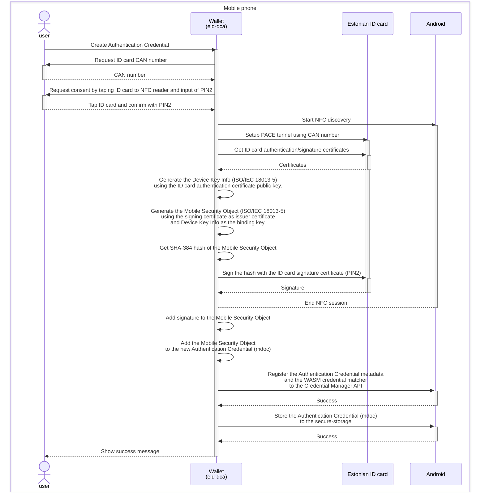
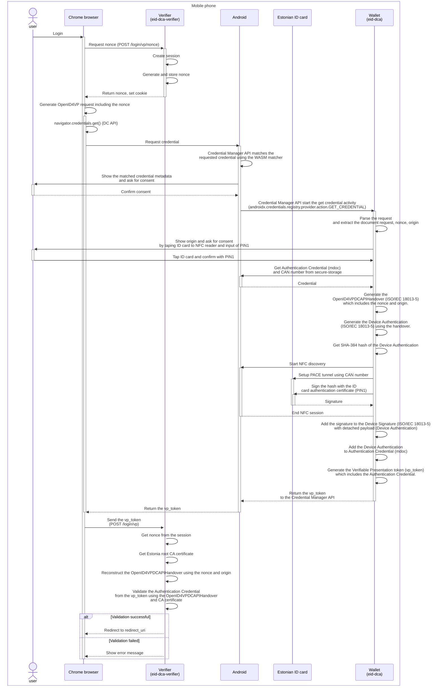

# eid-dca-verifier

Proof of concept verifier for the [Digital Credential API](https://github.com/w3c-fedid/digital-credentials) accepting Estonian ID card self-signed authentication credential in [ISO/IEC 18013-5](https://www.iso.org/standard/69084.html) format. 
To generate and present the authentication credential, use the [eid-dca](https://github.com/aarmam/eid-dca) wallet.

## Requirements

- Chrome 128 or later
- Enable the flag at chrome://flags#web-identity-digital-credentials

Read more about the [Digital Credentials API origin trial](https://developer.chrome.com/blog/digital-credentials-api-origin-trial)

## Running in Docker

Build docker image locally

```shell
./mvnw spring-boot:build-image
```

or inside Docker

Windows Powershell
```shell
docker run --pull always --rm -v /var/run/docker.sock:/var/run/docker.sock -v "${env:USERPROFILE}\.m2:/root/.m2" -v "${PWD}:/usr/src/project" -w /usr/src/project maven:3.9-eclipse-temurin-21 mvn spring-boot:build-image -DskipTests
```

Linux
```shell
docker run --pull always --rm -v /var/run/docker.sock:/var/run/docker.sock -v "$HOME/.m2:/root/.m2" -v "$PWD:/usr/src/project" -w /usr/src/project maven:3.9-eclipse-temurin-21 mvn spring-boot:build-image -DskipTests
```

Run the verifier service

```shell
docker compose up
```

Test the authentication flow

https://eid-dca-verifier.localhost:8443

## Credential generation flow



## Authentication flow

